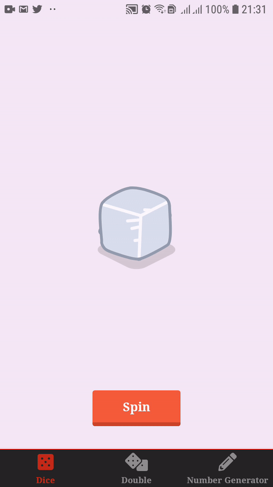
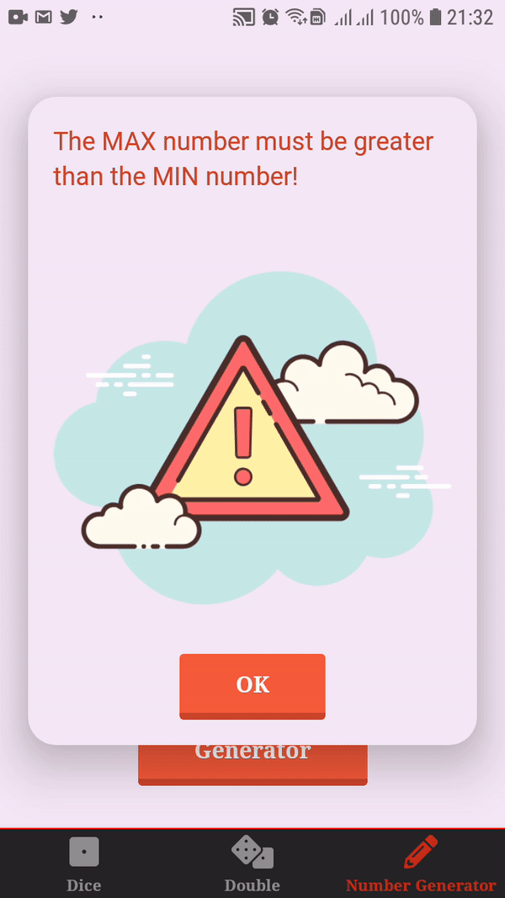

<h1 align="center">
 
  Dice Roller & Number Generator - Mobile
</h1>

Mobile application to generate random numbers with a dice or specific values.

 <a href="#-features">Features</a> •
 <a href="#-tech">Technologies</a> • 
 <a href="#-license">License</a> • 
 <a href="#-license">Useful Links</a> • 

  
  

<h4 align="center"> 
	Stand by ...  🚧
</h4>

# Features 

-   [x] User can use a dice to generate a random number.
-   [x] User can use a max and min value to generate a specific value.
-   [x] User can change between dice colors.

### 🛠 Technologies 

The following tools was used in this project:
- [React JS](https://https://reactjs.org/)

## Getting started 

In the project directory, you can run:

### `yarn start`

Runs the app in the development mode. 
Open [http://localhost:3000](http://localhost:3000) to view it in the browser.

The page will reload if you make edits. 
You will also see any lint errors in the console.

## License 

	This project is licensed under the MIT License - see the  
  
	for details.

